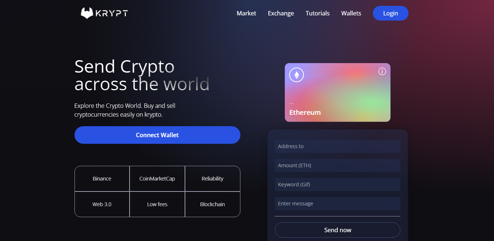

### Krypt Web 3.0

### :link: https://kyrpt.netlify.app

### Learned from : [JavaScript Mastery](https://youtu.be/Wn_Kb3MR_cU)

## Images

## Mobile Responsive

## Run Locally

- Run this command `git clone https://github.com/aliaftabsheikh/Krypt-Web-3.git`
- You are now in the dev environment and you can play around

## Tech Stack

- HTML5
- CSS3
- Javascript
- React js
- Solidity
- Giphy

## How we Learn

- React Functional components and their reusability
- React file and folder structure
- Fundamental of Tailwind css classes and its uses.
- Solidity for send Ethereum and record in Transactions 